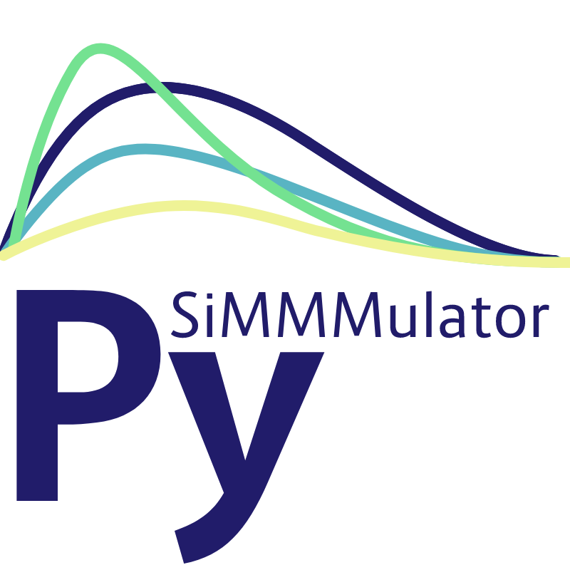

# PySiMMMulator

[](https://www.codefactor.io/repository/github/ryanaugust/pysimmmulator)
[](
https://pypi.org/project/pysimmmulator/)

PySiMMMulator is an open source Python framework for simmulation of Marketing data for use in testing Marketing Mix Models (MMMs).
While this package cointains a full pipeline for data generation (configurable via .conf file) it can also be utilized in parts to generate select portions of MMM input data (ie campaign/channel spend)

Originally predicated on adapting the R-package [siMMMulator](https://github.com/facebookexperimental/siMMMulator) for python. PySiMMMulator has retained core function parallels to the functions of siMMMulator but has since expanded capabilities to support a far broader array of MMM inputs and utlities.

## Installation

Accessable via PyPI

```bash
pip install pysimmmulator
```

## Usage

PySiMMMulator's simulator can either be run on a step-by-step basis, or can be run single-shot by passing a config file.

### Run via config

Run using this method, you'll be returned both a dataframe of for MMM input as well as the "True ROI" values for each of your channels. These true values are critical to validating your MMM model.

```python
cfg = load_config(config_path="./my_config.yaml")
simmm = Simulate()
mmm_input_df, channel_roi = simmm.run_with_config(config=cfg)
```

### Run via CLI

A configuration file is required as input for this and should be passed as seen below. An output path can also be passed via `-o`, however when not passed the current working directory will be used.

```bash
pysimmm -i example_config.yaml -o .
```

### Run by stages

Alternatively you may run each of the stages independently, which allows for easier debugging and in-run adjustments based on the results of each stage. The order of the stages is reflected below **(without their inputs)**. Once you've run through every stage, results are available by calling the `sim.final_df` object (channel ROI results are stored as `sim.channel_roi`).

```python
simmm = Simulate()
simmm.simulate_baseline()
simmm.simulate_ad_spend()
simmm.simulate_media()
simmm.simulate_cvr()
simmm.simulate_decay_returns()
simmm.calculate_conversions()
simmm.consolidate_dataframe()
simmm.calculate_channel_roi()
simmm.finalize_output()
```

### Geographic distribution

Marketing Mix Models may use geographic grain data for the purposes of budget allocation or during the calibration phase. PySiMMMulator provies `Geos` to facilitate the generation of rancomized geographies as well as a distribution funciton to allocated synthetic data across the geographies.


### Study simulation

`Study` and `BatchStudy` are also provided to simplify the simulated outcomes of marketing studies, which are an important component of MMM calibration.

Within this framework studies results are drawn from a normal distribution about the true value of a channels effectiveness (defaulted to ROI within this package). Both `Study` and `BatchStudy` provide the ability to pass bias and standard deviation prameters for stationary and non-stationary distributions—allowing users to replicate a diverse set of real-world measurement difficulties.
## Development

Setting up a dev environment

```bash
python3 -m venv venv
source venv/bin/activate
pip install -e '.[dev]'
```
