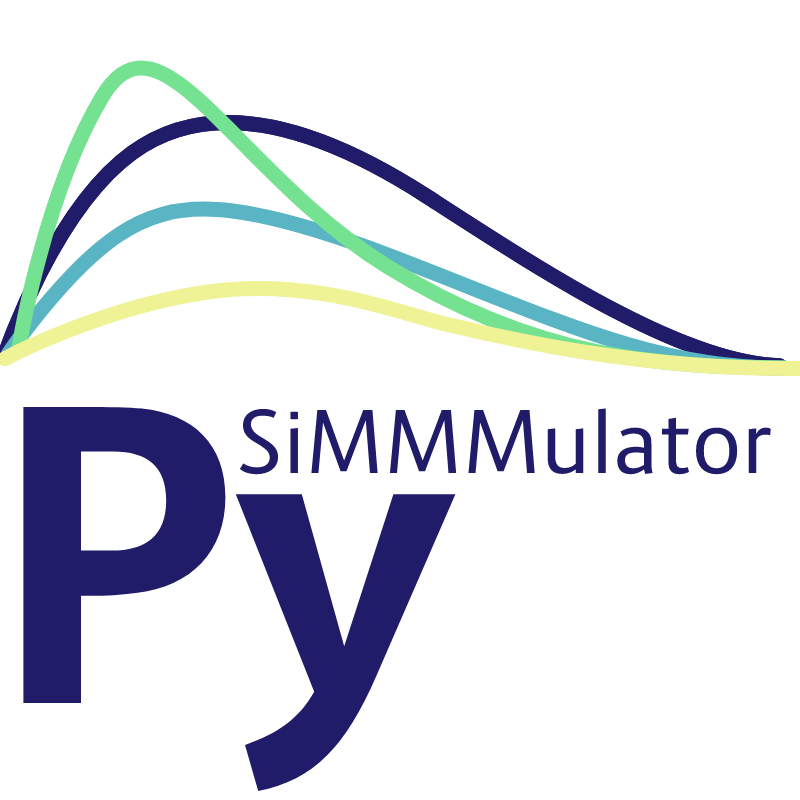

# PySiMMMulator

[](https://www.codefactor.io/repository/github/ryanaugust/pysimmmulator)
[](https://pepy.tech/projects/pysimmmulator)

PySiMMMulator is an open source Python framework for simulation of Marketing data for use in testing Marketing Mix Models (MMMs).
While this package contains a full pipeline for data generation (configurable via YAML) it can also be utilized in parts to generate select portions of MMM input data (e.g. campaign/channel spend).

Originally predicated on adapting the R-package [siMMMulator](https://github.com/facebookexperimental/siMMMulator) for python. PySiMMMulator has retained core function parallels to the functions of siMMMulator but has since expanded capabilities to support a far broader array of MMM inputs and utilities (e.g. geographic distribution, modular adstock/saturation).

## Installation

Accessable via PyPI

```bash
pip install pysimmmulator
```

## Usage

PySiMMMulator's simulator can either be run on a step-by-step basis, or can be run single-shot by passing a config file.

### Run via config

Run using this method, you'll be returned both a dataframe of for MMM input as well as the "True ROI" values for each of your channels. These true values are critical to validating your MMM model.

```python
from pysimmmulator import load_config, Simulate

cfg = load_config(config_path="./my_config.yaml")
simmm = Simulate()
mmm_input_df, channel_roi = simmm.run_with_config(config=cfg)
```

### Run via CLI

A configuration file is required as input for this and should be passed as seen below. An output path can also be passed via `-o`, however when not passed the current working directory will be used.

```bash
pysimmm -i example_config.yaml -o .
```

### Run by stages

Alternatively you may run each of the stages independently, which allows for easier debugging and in-run adjustments. Due to the stateless architecture, each stage returns its results which are then passed to the next stage.

```python
from pysimmmulator import load_config, Simulate, define_basic_params

cfg = load_config("./my_config.yaml")
basic_params = define_basic_params(**cfg["basic_params"])
simmm = Simulate(basic_params)

baseline_df = simmm.simulate_baseline(**cfg["baseline_params"])
spend_df = simmm.simulate_ad_spend(baseline_sales_df=baseline_df, **cfg["ad_spend_params"])
spend_df = simmm.simulate_media(spend_df=spend_df, **cfg["media_params"])
spend_df = simmm.simulate_cvr(spend_df=spend_df, **cfg["cvr_params"])
mmm_df = simmm.simulate_decay_returns(spend_df=spend_df, **cfg["adstock_params"])
mmm_df = simmm.calculate_conversions(mmm_df=mmm_df)
mmm_df = simmm.consolidate_dataframe(mmm_df=mmm_df, baseline_sales_df=baseline_df)
channel_roi = simmm.calculate_channel_roi(mmm_df=mmm_df)
final_df = simmm.finalize_output(mmm_df=mmm_df, **cfg["output_params"])
```

### Geographic distribution

Marketing Mix Models may use geographic grain data for the purposes of budget allocation or during the calibration phase. PySiMMMulator provides `Geos` to facilitate the generation of randomized geographies as well as a distribution function to allocate synthetic data across the geographies.


### Study simulation

`Study` and `BatchStudy` are also provided to simplify the simulated outcomes of marketing studies, which are an important component of MMM calibration.

Within this framework study results are drawn from a normal distribution about the true value of a channel's effectiveness (defaulted to ROI within this package). Both `Study` and `BatchStudy` provide the ability to pass bias and standard deviation parameters for stationary and non-stationary distributions—allowing users to replicate a diverse set of real-world measurement difficulties.
## Development

Setting up a dev environment

```bash
python3 -m venv venv
source venv/bin/activate
pip install -e '.[dev]'
```
